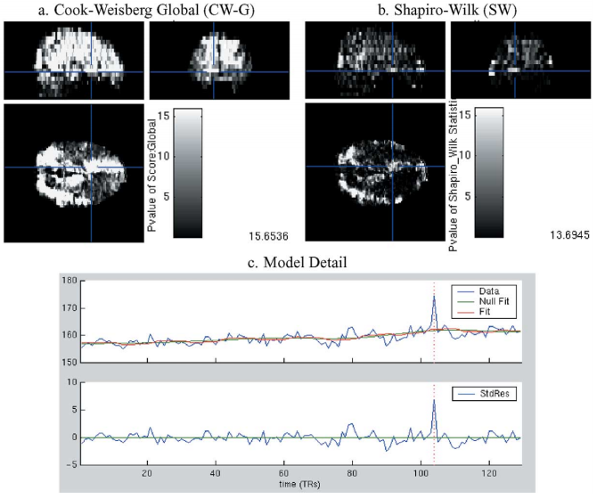
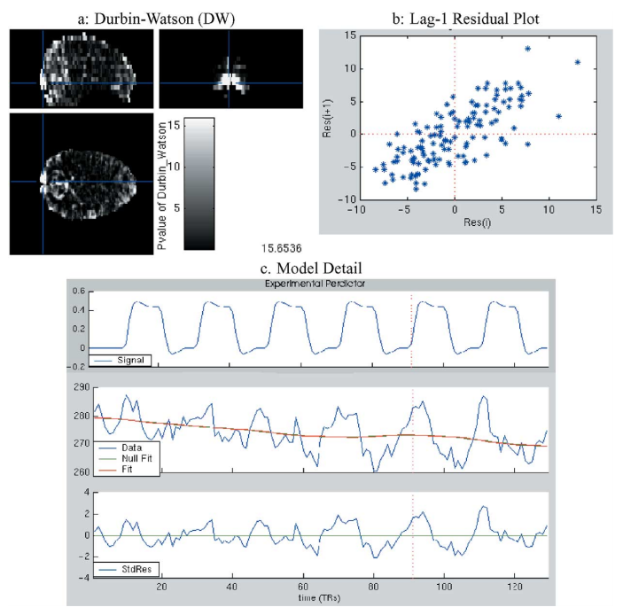

```{r setup, include = FALSE}
knitr::opts_chunk$set(echo = FALSE, 
                      comment = NA, 
                      warning = FALSE, 
                      message = FALSE, 
                      fig.pos = 'H', 
                      fig.align = 'center', 
                      # fig.height = 2, 
                      fig.width = 10)
```

# The General Linear Model for fMRI Data

$$Y = X \beta + \epsilon$$

* Performed for each voxel independently
* Typical setup[^1]
    * ~100,000 voxels $\implies$ ~100,000 separate models
        * Here the authors do not consider spatial dependence
    * Within each model, each observation (row) is a point in time
    * $Y$ is the *observed* fMRI signal (e.g., based on canonical function)
    * One of the columns of $X$ is the *expected* fMRI signal (e.g., something
    based on the canonical function)
        * Sometimes there are multiple expected signals based on different 
        types of tasks/functions
    * Noise/error $\epsilon \sim \mathcal{N}(0, \sigma^2 V)$, where $V$ can 
    take on some autoregressive structure
        * Here the authors assume $V = I$, i.e., no autoregression(?)
* Presence of effects at each voxel based on $t$-scores of the estimated 
$\hat{\beta}$'s

[^1]: Oxford Neuroimaging Primer 
https://www.fmrib.ox.ac.uk/primers/appendices/glm.pdf

# The Problem 

* Fitting, analyzing, and performing diagnostics for one model can be a big task
    * Linear models make many implicit and explicit assumptions
    * Breaking these assumptions can result in incorrect conclusions
* False positives or artifacts can arise from systematic noise (e.g., 
movement, drift, machine failure)
* Outlier detection
* But we have ~100,000 models---not feasible to do this for each model 
separately
* Also need to control for false discovery rate

# Proposed Model Diagnostics Methodology

1. Explore scan summaries
2. Explore model summaries
3. Explore model detail
4. Explore scan detail
5. Remediation
6. Resolution

# Scan summaries

Goals:

* Identify whether there appears to be *some* overall
* Identify outliers caused by systematic issues

Stacked timeseries plots of:

* Predictors (e.g., expected BOLD signal)
* Observed global BOLD signal
* Outlier counts
* Head movement

```{r}

```

# Model Summaries

Goals:

* Model diagnostics and assumption checks
* Exploratory data analysis

Method:

1. Fit the model at each voxel
2. Check exploratory summaries to see where the signal is
    * Contrast estimates
    * Percent change threshold
3. Check diagnositics summaries to check for model validity
    * Check that residuals are iid normal

```{r}

```

# Model and Scan Detail

Model detail

* Check model validity at the voxel level
* Instead of model summary statistics across voxels, make individual plots for
    * fitted vs. residuals
    * quantile-quantile plots
    * Fitted vs. observed

Scan detail

* Consider spatial extent/correlation of model issues
* Correspond model issues to systematic problems (such as scanning artifacts)

# Remediation and Resolution

* Data removal
    * One observation at a voxel
    * Entire voxels
* Model modification
    * Refit model adding/removing covariates
* Assess results
    * Are positives real or artifacts
    * False discovery rate

# Simulation Example

Setup

* $\text{signa}_t \sim \text{expected response}_t + \text{drift}_t + \epsilon_t$
* $\epsilon_t$ are iid normal, AR(1) with fixed $\rho \in (.1, .5)$, or 
AR(12)
* Models fit at each voxel (assuming iid normal residuals), then residuals
computed at each voxel
* Voxel-level model rejection based on diagnostic statistics on residuals:
    * Durbin-Watson test (autoregression)
    * Cumulative periodogram test (periodicity)
    * Shapiro-Wilk test (normality)
    * Cook-Weisberg score test (heteroskedasticity)
    * Outlier test
* As expected, increased autocorrelation resulted in failing the Durbin-Watson 
and cumulative periodogram tests
    * CP test more useful for detecting higher-order autoregression
    * DW test failed to detect the model was incorrect for AR(12) data

# Real Data Example

* Block design word generation task
* Six cycles of rest/active with final rest cycle
* Active: Subject asked to generate a word starting with each letter of the 
alphabet
* 20 scans per cycle
* $128 \times 128 \times 20$ voxels of size $1.88 \times 1.88 \times 7$ mm

# Real Data Example

```{r}

```

# Real Data Example

```{r}

```

# Real Data Example

```{r}

```

# Real Data Example

```{r}

```

# Real Data Example

```{r}

```