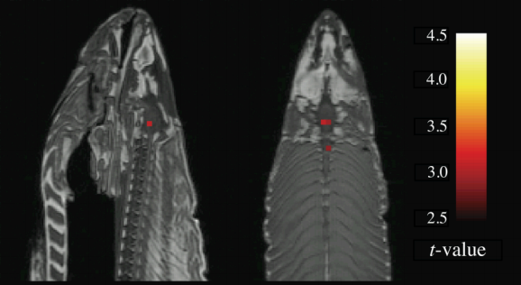

```{r setup, include=FALSE}
knitr::opts_chunk$set(echo = FALSE, 
                      comment = NA, 
                      warning = FALSE, 
                      message = FALSE,
                      fig.lp = '')

options(xtable.comment = FALSE, 
        xtable.table.placement = 'H')

library(ggplot2)

theme_set(theme_bw())
```

# Hypothesis Testing

|                      | $H_0$ is true | $H_A$ is true
|----------------------|---------------|---------------
| Reject $H_0$         | Type I error  | $\checkmark$
| Fail to reject $H_0$ | $\checkmark$  | Type II error


$P(\text{reject } H_0 \mid H_0 \text{ is true}) = \alpha$

$P(\text{fail to reject } H_0 \mid H_0 \text{ is false}) = 1 - \beta$  
$P(\text{reject } H_0 \mid H_0 \text{ is false}) = \beta$

We want to increase $\beta$ while controlling $\alpha$

# The Multiple Comparisons Problem


# The Multiple Comparisons Problem

**Family-wise error rate (FWER)** - The probability that at least one test 
in a set of tests will result in a type I error, given that the null hypothesis 
is true for all of them

If we have $m$ independent tests all with significance level $\alpha$,  
then the FWER is given by:

$\begin{split}
  FWER & = P(\text{reject at least once}) \\
  & = 1 - P(\text{fail to reject all}) \\ 
  & = 1 - (P(\text{fail to reject}))^m \\
  & = 1 - (1 - P(\text{reject}))^m \\
  & = 1 - (1 - \alpha)^m
\end{split}$

```{r}
alpha <- .01
m <- seq(1000)
fwer <- 1 - (1 - alpha) ** m

ggplot() + 
  geom_line(aes(x = m, y = fwer)) + 
  labs(y = expression('FWER at' ~ alpha == 0.01))
```

Bonferroni correction: $\alpha_{single} = \frac{\alpha_{FWER}}{m}$  
Sidak correction: $\alpha_{single} = 1 - (1 - \alpha_{FWER})^{1/m}$

# The Multiple Comparisons Problem and the GLM 

1. At each voxel: 
    * Fit OLS model $Y = X \beta + \epsilon$ (maybe with prewhitening)
    * Perform test $H_A: \beta_j \neq 0$
2. Conclude that there is activation at the voxels for which we reject $H_0$

* Typical fMRI scan: ~130,000 voxels  
* If we set $\alpha = 0.01$ and there is no correlation between the task and 
the BOLD signal, then we expect ~1,300 "activated" voxels
* Things that might help alleviate this problem:
    * Only consider contiguous clusters of voxels as active regions
    * Match activations with known brain regions
    * Voxels are not actually independent (spatial correlation/dependence)
* Bonferroni and Sidak corrections are not going to work here  
($m$ is too high and $\alpha \approx 0$ if we try)

# The Salmon Experiment

* Block design
* Dead salmon shown series of photographs and asked about what the people in 
each photo was experiencing
* $\alpha = 0.001$, 3 voxel extent threshold



* Second analysis with multiple comparisons correction
    * Benjamini and Hochberg
        1. Sort the voxels by $p$-value in increasing order
        2. Find the largest $k \in \mathbb{N}$ such that 
        $p_{(k)} \leq \frac{k \alpha}{m}$
        3. Reject $H_0$ for the first $k$ voxels and fail to reject for the 
        last $m - k$
    * Gaussian random field theory